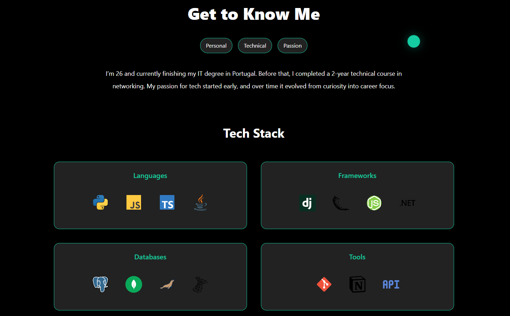
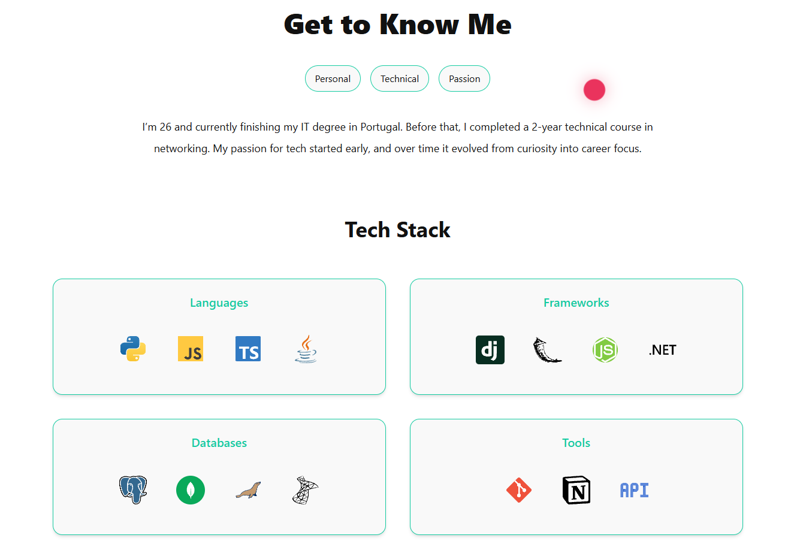

# 🧑‍💻 Diogo Sal — Developer Portfolio

Welcome to my personal developer portfolio built with **Django** and styled using **TailwindCSS**. This site showcases selected GitHub projects, my tech stack, and background — all wrapped in a dynamic and animated single-page experience.

---

## 🚀 Features

- 🎨 Custom dark/light mode with accent highlight
- 🌀 Interactive ripple background effects (Canvas)
- 🎯 Animated section transitions and cursor effects
- 🧠 Tabbed About section with personal, technical & passion segments
- 💻 Dynamic project grid (pulls from GitHub)
- 🔧 Tech stack icons with scroll-triggered animation

---

## 📁 Project Structure

```
.
├── portfolio/              # Django app
│   ├── templates/
│   │   └── index.html      # Main portfolio page
│   ├── static/
│   │   ├── css/style.css   # Stylesheet with themes + animations
│   │   ├── js/script.js    # Main JavaScript (cursor, ripples, tabs, etc.)
│   │   └── icons/          # Tech stack icons
├── manage.py
└── README.md
```

---

## 🛠 Tech Stack

- **Backend:** Python 3, Django
- **Frontend:** HTML, TailwindCSS, JavaScript (Vanilla), GSAP for animations
- **Database:** SQLite (default, lightweight for demo)
- **Other:** GitHub API (to list projects dynamically)

---

## 🧪 How to Run Locally

1. **Clone the repo:**

```bash
git clone https://github.com/yourusername/django-portfolio.git
cd django-portfolio
```

2. **Create a virtual environment:**

```bash
python -m venv venv
source venv/bin/activate  # on Windows use: venv\Scripts\activate
```

3. **Install dependencies:**

```bash
pip install -r requirements.txt
```

4. **Run the server:**

```bash
python manage.py runserver
```

Open your browser and go to [http://localhost:8000](http://localhost:8000)

---

## 📷 Screenshots

| Dark Mode | Light Mode |
|-----------|------------|
|  |  |

---

## 📝 License

This project is for educational and portfolio purposes only.

---

## 🙋‍♂️ Author

**Diogo Sal**  
Back-end focused developer based in Portugal  
[GitHub](https://github.com/friendtm) • [LinkedIn](https://linkedin.com/in/diogo-sal-316714230)
